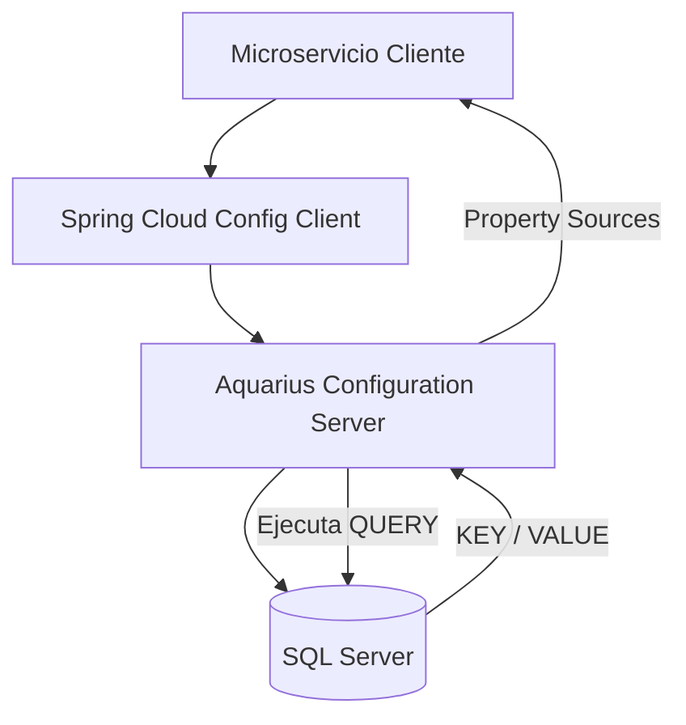

# Aquarius Configuration Server

Servidor de configuraciones basado en **Spring Cloud Config Server**. Expone configuraciones por `application`,
`profile` y `label`, obteniéndolas desde **SQL Server** para el proyecto de microservicios Aquarius.

## Tabla de contenido

- [Stack](#stack)
- [Requisitos](#requisitos)
- [Ejecución local](#ejecución-local)
- [Fuente de configuraciones](#fuente-de-configuraciones)
- [Configuración](#configuración)
- [Endpoints](#endpoints)
- [Salud y observabilidad](#salud-y-observabilidad)
- [Pruebas](#pruebas)
- [Build y ejecución del JAR](#build-y-ejecución-del-jar)
- [Docker](#docker)
- [Migraciones](#migraciones)
- [Convenciones](#convenciones)
- [Arquitectura](#arquitectura)
- [Troubleshooting](#troubleshooting)

---

## Stack

- Java: 17
- Spring Boot: 4.0.1
- Spring Cloud Config Server: Sí
- Build: Maven
- Fuente de configuración: SQL Server
- Observabilidad: N/A (por ahora)

## Requisitos

### Para correr **sin Docker**

- JDK 17
- Maven 3.9+
- Acceso a **SQL Server** (local o remoto) con credenciales válidas.

### Para correr **con Docker** (opcional)

- Docker
- Docker Compose (opcional)

> Docker es opcional. Si no lo usas, ejecutas con Java/Maven. Si lo usas, todo corre dentro del contenedor.

## Ejecución local

### Opción A) IDE

1. Importa el proyecto en IntelliJ/Eclipse
2. Ejecuta la clase `AquariusApplication.java`

### Opción B) CLI

#### Maven

```bash
mvn spring-boot:run
```

La aplicación queda disponible en: http://localhost:8888

## Fuente de configuraciones

Este servidor **NO utiliza repositorios Git** como backend de configuración.

Las propiedades se obtienen desde una base de datos **SQL Server** usando JDBC, mediante la propiedad:

`spring.cloud.config.server.jdbc.sql=${QUERY}`

El endpoint `/{application}/{profile}/{label}` ejecuta esta consulta para construir dinámicamente el property-source y
devolver las propiedades en formato compatible con Spring Cloud Config.

## Configuración

La configuración vive en:

* src/main/resources/application.properties (defaults)
* src/main/resources/application-mssql.properties (SQL Server)

### Perfiles

Este proyecto usa **perfiles de Maven** para definir los perfiles de Spring.
En el `pom.xml` existe el perfil Maven `mssql` y está activo por defecto (`activeByDefault=true`), por lo tanto:

- `spring.profiles.active = mssql`
- `spring.profiles.include = jdbc`

Estos valores se inyectan en `application.properties` usando placeholders:

- `spring.profiles.active=@spring.profiles.active@`
- `spring.profiles.include=@spring.profiles.include@`

Esto significa que **no es necesario pasar perfiles manualmente** en la mayoría de los casos.

#### Ejecutar con el perfil por defecto (mssql)

```bash
mvn spring-boot:run
```

#### Forzar perfil Maven explícitamente

```bash
mvn -Pmssql spring-boot:run
```

#### Ejecutar el JAR ya compilado

```bash
java -jar target/aquarius-configuration-server.jar
```

#### Sobrescribir perfiles en runtime (opcional)

```bash
java -jar target/aquarius-configuration-server.jar --spring.profiles.active=mssql --spring.profiles.include=jdbc
```

> Nota: Por defecto, el perfil `mssql` ya viene activo al compilar con Maven, por lo que normalmente **no es necesario**
> pasar `--spring.profiles.active`.

### Variables de entorno

| Variable      | Descripción                  | Ejemplo                                                                                                                    |
|---------------|------------------------------|----------------------------------------------------------------------------------------------------------------------------|
| `DB_DATABASE` | Nombre de la BD.             | `CONFIGURATION_SERVER`                                                                                                     |
| `DB_HOST`     | Host de la BD.               | `0.0.0.0`                                                                                                                  |
| `DB_PORT`     | Puerto de la BD.             | `1433`                                                                                                                     |
| `DB_USER`     | Usuario de conexión a BD.    | `User`                                                                                                                     |
| `DB_PASS`     | Contraseña de conexión a BD. | `Password`                                                                                                                 |
| `QUERY`       | Consulta para                | `SELECT PROPERTY_NAME AS [KEY], PROPERTY_VALUE AS [VALUE] FROM CONFIG WHERE APPLICATION = ? AND PROFILE = ? AND LABEL = ?` |

> Importante: La `QUERY` debe devolver una columna `KEY` y otra `VALUE` o alias equivalentes, porque el servidor de
> configuraciones arma el property-source con esos pares.

## Endpoints

- Base URL: `http://localhost:8888`
- Swagger/OpenAPI: N/A

Endpoint principal (Config Server):

* `GET /{application}/{profile}/{label}`
    * `application`: nombre lógico del cliente (ej. billing-service)
    * `profile`: perfil (ej. dev o prod; soporta varios separados por coma)
    * `label`: etiqueta (ej. default)

Ejemplo:

* `GET /billing-service/dev/default`

## Salud y observabilidad

N/A

## Pruebas

```bash
mvn clean test
```

## Build y ejecución del JAR

### Build

```bash
mvn clean package
```

### Ejecución del JAR

```bash
java -jar target/aquarius-configuration-server.jar
```

## Docker

### Build imagen

```bash
docker build -t aquarius-configuration-server:latest .
```

### Run contenedor

```bash
docker run --rm -p 8888:8888 \
  -e DB_DATABASE=CONFIGURATION_SERVER \
  -e DB_HOST=host.docker.internal \
  -e DB_PORT=1433 \
  -e DB_USER=User \
  -e DB_PASS=Password \
  -e QUERY="SELECT F.PROPERTY_NAME AS [KEY], F.PROPERTY_VALUE AS [VALUE] FROM ..." \
  aquarius-configuration-server:latest
```

> Nota: `host.docker.internal` funciona para apuntar al host desde Docker en Windows/Mac. En Linux a veces hay que usar
> la IP del host o configurar la red.

## Migraciones

Pendiente.

## Convenciones

* Paquetes:
    * controllers (API)
    * models (Modelos de datos)
    * repositories (Persistencia)
    * services (Lógica)
    * components (Lógica)
    * configs (Configuraciones)

## Arquitectura

El Aquarius Configuration Server actúa como un punto centralizado de configuración para todos los microservicios del
ecosistema Aquarius.

En lugar de utilizar repositorios Git como backend, este servidor obtiene las propiedades directamente desde una base de
datos SQL Server mediante JDBC.

### Diagrama de arquitectura



### Flujo de la solicitud

1. Un microservicio cliente arranca y solicita su configuración al Config Server.
2. La solicitud se realiza al endpoint: `/{application}/{profile}/{label}`
3. El Config Server ejecuta dinámicamente la consulta definida en la variable de entorno QUERY.
4. La consulta obtiene las propiedades desde SQL Server.
5. El servidor construye el property-source en memoria.
6. Las propiedades son devueltas al microservicio en el formato estándar de Spring Cloud Config.

### Beneficios de esta arquitectura

* Centralización de configuraciones.
* No es necesario redeplegar microservicios para cambios de configuración.
* Persistencia de configuraciones en base de datos.
* Separación entre código y configuración.
* Compatible con entornos multi-profile (dev, qa, prod, etc.).

## Troubleshooting

### El puerto ya está en uso

Cambiar el puerto en `application.properties` o usar el argumento `--server.port=8081` al ejecutar el JAR o Maven

Ejemplos:

```bash
java -jar target/aquarius-configuration-server.jar --server.port=8081
```

```bash
mvn spring-boot:run -Dspring-boot.run.arguments="--server.port=8081"
```

### Error de conexión a DB

Verifica:

* host/puerto accesibles (telnet / nc)
* credenciales
* firewall
* si corres en Docker: red y resolución de `DB_HOST`

### La respuesta del Config Server viene vacía

* Confirma que para application/profile/label existan registros en BD
* Confirma que la QUERY devuelve pares KEY/VALUE